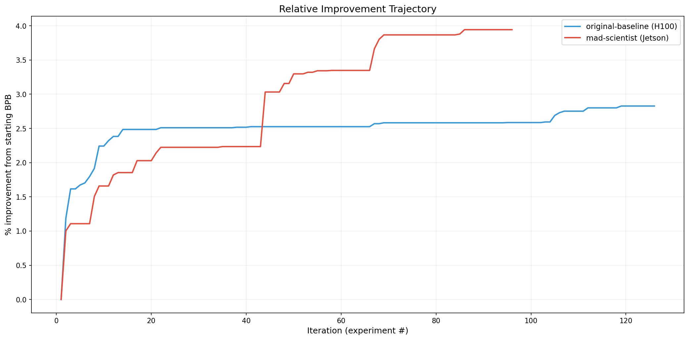

# (auto) autoresearch

A combined fork of [karpathy/autoresearch](https://github.com/karpathy/autoresearch) integrating ideas from the most innovative community forks: a creative director framework, Apple Neural Engine training, dual-backend MPS/MLX support, and continue-pretraining experiments.

---

## What is autoresearch?

An AI agent autonomously trains a small GPT model: modify code, run a 5-minute experiment, check if `val_bpb` improved, keep or discard, repeat overnight. The metric is **val_bpb** (validation bits per byte) — lower is better, vocab-size-independent.

## Quick start

**NVIDIA GPU (upstream baseline):**
```bash
uv sync
uv run prepare.py
uv run train.py
```

**Apple Silicon — MLX (recommended):**
```bash
uv sync --extra mlx
uv run prepare.py
uv run train_mlx.py
```

**Apple Silicon — MPS:**
```bash
uv sync --extra mps
uv run prepare.py
uv run train.py
```

**Apple Neural Engine (native Obj-C):**
```bash
cd native && make all
make test-ane
./build/train_overnight_nl6_s512 --steps 10000 --scratch --lr 2e-4 \
  --data data/train.bin --val data/val.bin
```

**Autonomous agent mode:**
```bash
claude --dangerously-skip-permissions -p "Read program.md and start autoresearch."
```

---

## Merged Forks

This repo combines work from four forks, each with a different angle:

### 1. Director Framework (from [ArmanJR-Lab](https://github.com/ArmanJR-Lab/autoautoresearch))

A Go binary ("director") that acts as a Creative Director / Chaos Monkey — generating research directives to escape local minima. It works in three steps:

1. **Summarize** the current `train.py` via DeepSeek Chat
2. **Fetch** a random ML paper abstract from arxiv (external novelty injection)
3. **Generate** a directive via DeepSeek Reasoner, framed as a suggestion

Each experiment method lives in its own directory:

| Name | Director | Description |
|------|----------|-------------|
| `baseline/` | None | Vanilla autoresearch (control group) |
| `mad-scientist/` | DeepSeek Reasoner (temp 1.2) | Code summary + experiment history + paper abstract → bold directive |
| `mad-scientist-3-11/` | DeepSeek Reasoner (temp 1.0) | Full paper summaries, narrower arxiv categories, stricter prompts |

**Results vs Karpathy's H100 baseline:**



| | original-baseline | mad-scientist | mad-scientist-3-11 |
|---|---|---|---|
| Experiments | 126 | 96 | 96 |
| Keeps (rate) | 23 (18.3%) | 22 (22.9%) | 16 (16.7%) |
| Total improvement | 2.83% | 3.94% | 2.79% |
| Best BPB | 0.969686 | 1.286357 | 1.302036 |

```bash
make list                                    # list director configs
make deploy EXPERIMENT=mad-scientist         # build + deploy director
```

### 2. Apple Neural Engine (from [ncdrone](https://github.com/ncdrone/autoresearch-ANE))

Three accelerators on one chip — ANE via native Obj-C, GPU via MLX, GPU via MPS:

- **ANE**: 67.6M param GPT, ~99ms/step, invisible to Activity Monitor, runs alongside GPU
- **MLX**: ~50M param GPT, val_bpb=1.665 baseline
- **MPS**: 11.5M param GPT, val_bpb=1.308 after 79 experiments

Key innovations:
- Dynamic weight pipeline: weights packed into IOSurface, `memcpy` updates (no recompilation)
- SRAM wall at SEQ=1024, depth U-curve at SEQ=512
- Multi-agent gossip protocol for cross-pollination between ANE/MLX agents

### 3. Dual-Backend MPS + MLX (from [elementalcollision](https://github.com/elementalcollision/autoresearch))

Full Muon optimizer ported to both PyTorch MPS and MLX, with critical bug fixes:

- **Newton-Schulz NaN fix**: bf16 Frobenius norm loses precision in MLX (doesn't upcast like PyTorch). Large matrices (512x2048) cause spectral norm >1, Newton-Schulz coefficients amplify error exponentially. Fix: run orthogonalization in float32.
- **NaN fast-fail blindspot**: `NaN > 100` is `False` in Python — NaN loss was silently ignored for entire 5-min runs. Fix: add `math.isnan()` check.
- **MLX optimizer KeyError**: `value_embeds` uses dict keys ("0","1"...) not list indices — path navigation assumed lists only.
- **bf16 attention mask overflow**: `-inf` in bf16 + large scores = NaN. Fix: float32 masks.
- **Hardware auto-detection**: Identifies M1-M4 chip tier, scales hyperparams per chip.

Cross-chip results:

| Chip | Memory | Best val_bpb | Peak mem | Steps |
|------|--------|-------------|----------|-------|
| **M4 Pro** | 24 GB | **1.429** | 4.5 GB | 751 |
| M1 Max | 64 GB | 1.621 | 11.3 GB | ~210 |

Key insight: smaller batches → more optimizer steps → better results within the fixed 5-min budget.

### 4. Qwen Continue-Pretrain (from [CrystinVW](https://github.com/CrystinVW/autoresearch-mps))

Lives in `qwen-mps/`. A fundamentally different approach: continue-pretraining **Qwen3.5-0.8B** via HuggingFace transformers instead of training a GPT from scratch.

- Uses **Adafactor** optimizer (memory-efficient, no second moment storage)
- 19 methodical experiments: val_bpb 0.7818 → 0.7778
- Key findings: freezing embeddings saves 1GB, LR 4-6e-6 beats higher, cooldown ratio 0.7 optimal

### 5. Free-Tier Colab/Kaggle T4 (from [parthwhy](https://github.com/parthwhy/autoresearch-lite))

Lives in `colab-t4/`. Makes autoresearch accessible to anyone with a Google account — zero cost, zero local setup.

- Runs on **Google Colab T4** (free tier) and **Kaggle T4** (30 hrs/week free)
- FA3 → PyTorch SDPA, dataset swapped to **TinyStories** (public, lower entropy)
- Scaled hyperparams: SEQ=256, VOCAB=2048, DEPTH=4, batch 16K tokens
- Self-contained **Colab/Kaggle notebook** (`colab_kaggle.ipynb`) with automated Python agent loop using OpenRouter API (free tier), auto-commit, resume-safe
- 22 autonomous experiments, baseline val_bpb=0.686 at only 901MB VRAM / 5.2M params

---

## Project Structure

```
# Upstream baseline (CUDA)
train.py                    NVIDIA GPU training (agent modifies this)
prepare.py                  Data prep, tokenizer, evaluation (read-only)
program.md                  Agent instructions

# Director framework (ArmanJR-Lab)
baseline/                   Vanilla autoresearch (control group)
mad-scientist/              Director-driven exploration
mad-scientist-3-11/         Refined director variant
director/                   Go director source + configs
analysis.ipynb              Cross-method comparison

# Apple Neural Engine (ncdrone)
native/                     ANE hardware-level training (Obj-C, private APIs)
  runtime/                  ANE interface (_ANEInMemoryModel, IOSurface)
  mil/                      MIL code generation, dynamic weight pipeline
  training/                 Training loop, CPU fallback ops
  bridge/                   C API for Python ctypes
  probes/                   Hardware exploration (SRAM, weight patching)

# Dual-backend MPS + MLX (elementalcollision)
train_mlx.py                MLX training script (agent modifies this)
backends/
  __init__.py               Hardware detection, chip tier, hyperparameter suggestions
  muon_mps.py               Muon+AdamW optimizer for PyTorch MPS
  muon_mlx.py               Muon+AdamW optimizer for MLX (with NaN fixes)

# MLX GPU training (ncdrone, from trevin-creator)
mlx/                        MLX training port
  train.py, prepare.py, program.md

# Qwen continue-pretrain (CrystinVW)
qwen-mps/                   Qwen3.5-0.8B continue-pretraining on MPS

# Free-tier Colab/Kaggle T4 (parthwhy)
colab-t4/                   Zero-cost port for Google Colab / Kaggle T4

# Visualization & analysis
viz/                        Result visualization scripts
karpathy/                   Reference baseline results
```

## Backend Selection

The system auto-detects the best backend (prefers MLX). Override with:

```bash
AUTORESEARCH_BACKEND=mlx uv run train.py    # Force MLX
AUTORESEARCH_BACKEND=mps uv run train.py    # Force MPS
uv run train_mlx.py                          # Run MLX directly
```

### Hardware-adaptive defaults

| Chip tier | Memory | Model depth | Device batch | Total batch |
|-----------|--------|-------------|-------------|-------------|
| Base (M1-M4) | 8-24 GB | 4 | 8 | 32K tokens |
| Pro | 18-36 GB | 6 | 16 | 64K tokens |
| Max | 36-128 GB | 8 | 32 | 128K tokens |
| Ultra | 64-192 GB | 10 | 64 | 256K tokens |

## Technical Notes

### MPS backend
- No `torch.compile` (not supported on MPS)
- All optimizer arithmetic in float32 to avoid mixed-dtype crashes
- Nesterov momentum uses explicit `mul_/add_` instead of `lerp_` (MPS dtype issue)

### MLX backend
- Newton-Schulz orthogonalization in float32 (bf16 precision loss causes NaN)
- Gradient accumulation via `tree_map`
- Explicit `mx.eval()` calls for lazy evaluation control

### ANE backend
- Dynamic weight pipeline: weights in IOSurface, memcpy updates
- 33% ANE compute, 30% IO, 37% CPU (classifier is 22% bottleneck)
- SRAM wall at SEQ=1024

## Credits

- [Andrej Karpathy](https://github.com/karpathy) — autoresearch concept and nanochat
- [ArmanJR-Lab](https://github.com/ArmanJR-Lab/autoautoresearch) — Go director framework and mad-scientist experiments
- [ncdrone](https://github.com/ncdrone/autoresearch-ANE) — ANE native training, MLX port, multi-agent gossip
- [elementalcollision](https://github.com/elementalcollision/autoresearch) — Dual MPS/MLX backend, Muon optimizer port, Newton-Schulz NaN fix
- [CrystinVW](https://github.com/CrystinVW/autoresearch-mps) — Qwen3.5-0.8B continue-pretrain, Adafactor, methodical experiments
- [trevin-creator](https://github.com/trevin-creator) — Original MLX port
- [miolini](https://github.com/miolini) — MPS/macOS port
- [maderix](https://github.com/maderix) — ANE private API reverse engineering
- [parthwhy](https://github.com/parthwhy/autoresearch-lite) — Free-tier Colab/Kaggle T4 port with automated agent notebook
- [Apple MLX team](https://github.com/ml-explore/mlx)

## Community Results

Results from the community running autoresearch on different hardware. As noted in the design choices section, results are not directly comparable across hardware tiers — each platform finds its own optimal config for the 5-minute budget.

### NVIDIA RTX 3090 (24 GB VRAM)

**Run:** ~1,800 experiments over ~48 hours (March 2026), agent: Claude Sonnet 4.6

| val_bpb | Δ vs baseline | Config |
|---------|--------------|--------|
| 1.5963 | — | depth=8, device_bs=16 — **baseline** |
| 1.1917 | -25.3% | `TOTAL_BATCH_SIZE=2**17`, grad_accum=2, sqrt-scaled LR |
| 1.1209 | -29.8% | `TOTAL_BATCH_SIZE=2**16`, grad_accum=1, scaled LR |
| 1.1134 | -30.3% | `TOTAL_BATCH_SIZE=2**16`, original LRs (don't scale) |
| 1.1064 | -30.7% | depth=6, dim=512 |
| 1.1016 | -31.0% | depth=5, dim=512 |
| **1.1008** | **-31.1%** | **depth=5, dim=512, SSSS window pattern — best** |

**Winning configuration:**

```python
DEPTH = 5                    # shallower wins at 5-min budget on this GPU
ASPECT_RATIO = 102           # → dim ≈ 512
HEAD_DIM = 128
TOTAL_BATCH_SIZE = 2**16     # ~65K tokens/step
DEVICE_BATCH_SIZE = 32       # safe for RTX 3090 at this depth/dim
WARMUP_RATIO = 0.0
WARMDOWN_RATIO = 0.6         # slightly longer warmdown than default
window_pattern = "SSSS"      # all sliding-window layers
```

**Key findings for RTX 3090 users:**

1. **Shallower beats deeper at 5-minute budget.** depth=4–5 consistently outperforms depth=8+. A shallower model gets more optimizer steps in 300 seconds, which matters more than capacity at this compute scale. depth=3 is too shallow (capacity bottleneck); depth=6+ loses too many steps.
2. **`TOTAL_BATCH_SIZE = 2**16` is the sweet spot.** `2**17` with grad accumulation gives too few steps; `2**15` introduces gradient noise. `2**16` with `grad_accum=1` maximizes clean optimizer steps.
3. **Do not scale learning rates with batch size.** The standard sqrt-scaling rule hurt performance. Original baseline LRs work better at `2**16`.
4. **`WARMDOWN_RATIO = 0.6` beats 0.5.** Marginally but consistently. Diminishing returns beyond 0.6.
5. **SSSS window pattern beats SSSL (default).** Small but consistent improvement.
6. **OOM notes:** The default `DEVICE_BATCH_SIZE=128` causes OOM on RTX 3090 — reduce to 16–32. Any config using depth=18+ will OOM even at `device_bs=8`. Keep an eye on peak VRAM in run logs.

## Notable forks (not merged)

- [miolini/autoresearch-macos](https://github.com/miolini/autoresearch-macos) — Canonical macOS MPS port (1,099 stars)
- [mutable-state-inc/autoresearch-at-home](https://github.com/mutable-state-inc/autoresearch-at-home) — Collaborative distributed platform (321 stars)
- [jsegov/autoresearch-win-rtx](https://github.com/jsegov/autoresearch-win-rtx) — Windows + RTX auto-profiling (195 stars)
- [andyluo7/autoresearch](https://github.com/andyluo7/autoresearch) — AMD ROCm port
- [bro4all/autoresearch-tenstorrent](https://github.com/bro4all/autoresearch-tenstorrent) — Tenstorrent TT-XLA
- [kousun12/darwin-derby](https://github.com/kousun12/darwin-derby) — Generalization
- [Aum08Desai/test-time-rl-discover](https://github.com/Aum08Desai/test-time-rl-discover-autoresearch) — RL-based config discovery
- [matt-langston/autoresearch](https://github.com/matt-langston/autoresearch) — DGX Spark (Blackwell), zero-diff wrapper

## License

MIT
