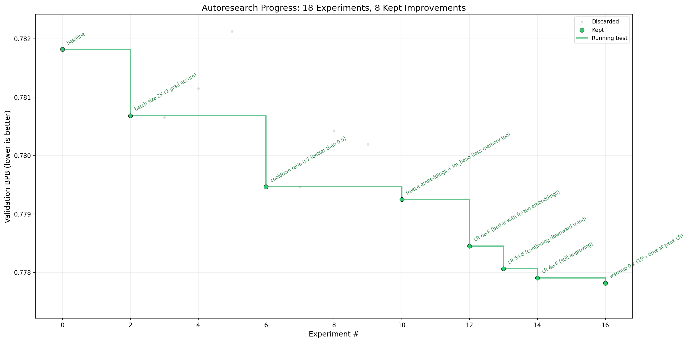

# autoresearch (MPS Fork)

> Built on [Andrej Karpathy's autoresearch](https://github.com/karpathy/autoresearch) — adapted for Apple Silicon MPS on a 16GB MacBook M2.



## What was changed and why

Karpathy's original requires an NVIDIA GPU (H100) and trains a custom GPT from scratch. This fork makes it runnable on a Mac:

| Change | Why |
|---|---|
| **Swapped custom GPT → Qwen3.5-0.8B** | Continued pretraining on an existing model gives a much stronger starting point than training from scratch in a short time window |
| **CUDA → MPS device** | Apple Silicon's GPU backend; replaced Flash Attention with PyTorch's `scaled_dot_product_attention` |
| **float32 → float16 weights** | Halves model memory (~1.2GB saved) to fit in 16GB unified RAM. M2 GPU runs float16 at 2× the speed of float32 |
| **AdamW → Adafactor** | Adafactor uses factored second moments instead of full buffers — uses ~4.4GB training memory vs AdamW's 11.3GB. Also tested SGD+Nesterov (7.5GB) |
| **Learning rate 2e-5 → 4e-6** | Conservative LR for float16 weight stability; agent found 4e-6 optimal with frozen embeddings |
| **Warmup ratio 0.05 → 0.2** | With only ~80 steps per run, the original 5% warmup was less than one step — LR jumped from 0 to full instantly, causing NaN. 20% ramps up gradually |
| **Batch size 131K → 2K tokens** | Reduces gradient accumulation from 64 → 2 steps so each optimizer step takes ~9s instead of ~200s, yielding ~80 steps per 5-min budget |
| **Sequence length 2048 → 1024** | Cuts attention memory (O(n²)) to prevent OOM. Pretrained long-range abilities are preserved in the base weights |
| **Eval tokens 21M → 262K** | Original eval took ~40 min on MPS (sized for H100). Reduced to ~262K tokens (128 steps at batch_size=2). Tradeoff: BPB estimates may fluctuate ±0.002–0.003 between runs (vs ±0.0003 with 21M), so very small improvements (<0.003) can be lost in noise, but meaningful gains (>0.005) are still detected reliably |
| **Added gradient checkpointing** | Trades compute for memory — recomputes activations instead of storing them |
| **Added `torch.mps.empty_cache()`** | Prevents MPS memory fragmentation buildup across steps |
| **Added NaN detection** | Immediately stops training if loss goes NaN instead of wasting the entire time budget on garbage gradients |
| **Added best-model saving** | Saves weights to disk only when val_bpb improves, so you can use your best model later |
| **Eval batch size 2 (with memory cleanup)** | Qwen3.5-0.8B's 248K vocab produces massive logits tensors during eval (`B × 1024 × 248,044`). Batch size 4 hits 18GB, batch size 8 hits 20GB on M2 — MPS overhead during eval is independent of optimizer choice since optimizer states are freed before eval |
| **Frozen embeddings + lm_head** | Freezing the embedding and output projection layers saves ~1GB memory and focuses training on the transformer layers where continued pretraining has the most impact |
| **Early `del logits` in forward pass** | After casting logits from fp16 to fp32, the fp16 copy is deleted immediately. Without this, both copies coexist (~1.2GB fp16 + ~2.4GB fp32 = 3.6GB). Freeing the fp16 copy saves ~1.2GB at zero cost |
| **Free optimizer + training state before eval** | Optimizer states are deleted before eval along with the training dataloader and batch tensors, since each run is a fresh process. With Adafactor this frees ~2GB; with AdamW it freed ~4GB |

## Understanding the loss

During a typical 5-minute training run (~80 steps), you'll see:

- **Steps 0–10** (`lrm: 0.00`): Warmup steps where the timer hasn't started. Loss fluctuates but this is just **different data batches**, not learning — the LR is zero.
- **Steps 11–25** (`lrm: 0.03 → 1.00`): LR ramps up (20% warmup). The model starts learning.
- **Steps 26–35** (`lrm: 1.00`): Full learning rate. Loss should stabilize or gradually decrease.
- **Steps 36–80** (`lrm: 0.97 → 0.03`): Cooldown (70% warmdown). LR decreases, loss typically smooths out.

Over many agent experiments, the **val_bpb** (measured after training) is what matters — not the training loss. The agent keeps code changes that lower val_bpb and discards the rest.

## How it works

*Original concept by [@karpathy](https://x.com/karpathy/status/2029701092347630069):*

Give an AI agent a small but real LLM training setup and let it experiment autonomously overnight. It modifies the code, trains for a fixed time budget, checks if the result improved, keeps or discards, and repeats.

The repo has three files that matter:

- **`prepare.py`** — data prep (downloads [climbmix](https://huggingface.co/datasets/karpathy/climbmix-400b-shuffle) shards), runtime utilities (dataloader, BPB evaluation). Not modified by the agent.
- **`train.py`** — continued pretraining of Qwen3.5-0.8B with Adafactor. The agent modifies this file to experiment with architecture, hyperparameters, etc.
- **`program.md`** — instructions for the AI agent. The human edits this.

## Quick start

**Requirements:** macOS with Apple Silicon (M1/M2/M3/M4), 16GB+ RAM, Python 3.10+, [uv](https://docs.astral.sh/uv/).

```bash
# 1. Install uv project manager (if you don't already have it)
curl -LsSf https://astral.sh/uv/install.sh | sh

# 2. Install dependencies
uv sync

# 3. Download data (one-time, ~2 min)
uv run prepare.py

# 4. Run a single training experiment (~9-10 min: 5 train + ~4 eval)
uv run train.py
```

## Current training config (16GB)

| Parameter | Value |
|---|---|
| Base model | Qwen3.5-0.8B (751M params) |
| Device | MPS (Apple Silicon) |
| Precision | float16 weights + autocast |
| Optimizer | Adafactor (factored second moments, memory-efficient) |
| Learning rate | 4e-6 with 20% warmup, 70% cooldown |
| Micro-batch size | 1 |
| Sequence length | 1024 |
| Total batch size | 2048 tokens (2 grad accum steps) |
| Gradient checkpointing | Enabled |
| Frozen layers | Embeddings + lm_head (transformer layers only) |
| Peak memory | ~4.4GB (training), ~10GB (eval after cleanup) |
| Training budget | 300s (5 min) |
| Eval budget | ~4 min (~262K tokens, 128 steps at batch_size=2) |
| Steps per run | ~80 |


## Memory breakdown (16GB M2)

Understanding where memory goes helps when tuning batch sizes or model choices.

### During training (~4.4GB peak, measured)

| Component | Size | Notes |
|---|---|---|
| Model weights (fp16) | ~1.5 GB | 752M params × 2 bytes |
| Adafactor optimizer states | ~0.3 GB | Factored second moments (row + col factors instead of full matrix) |
| Gradients | ~1.2 GB | Only unfrozen transformer layers (embeddings + lm_head frozen) |
| Activations (with grad checkpointing) | ~0.3 GB | Without checkpointing this would be ~2-3GB |
| Logits (fp32, training) | ~1.0 GB | 1 × 1024 × 248,044 × 4 bytes (micro-batch=1) |
| Dataloader buffers | ~0.1 GB | Pre-allocated CPU→GPU transfer tensors |

### During eval (~10GB peak after cleanup)

Before eval starts, optimizer states, gradients, and dataloader buffers are deleted via `del` + `gc.collect()` + `torch.mps.empty_cache()`.

| Component | Size (tensor math) | Actual MPS usage | Notes |
|---|---|---|---|
| Model weights (fp16) | ~1.5 GB | ~3 GB | MPS driver overhead roughly doubles allocations |
| Logits fp32 (batch_size=2) | ~2.0 GB | ~4 GB | 2 × 1024 × 248,044 × 4 bytes |
| Intermediate activations | ~0.5 GB | ~2 GB | Attention, MLP intermediates during forward |
| Token bytes lookup | ~0.6 MB | ~0.6 MB | Negligible |

**Key lesson:** MPS actual memory usage is roughly **2× the raw tensor math**. The driver maintains memory pools, alignment padding, and doesn't immediately reclaim freed allocations even with `empty_cache()`.

### Eval batch size vs memory (measured on M2 16GB)

The 248K vocab makes logits the dominant cost during eval. Actual measurements differ significantly from tensor math:

| Eval batch size | Logits (tensor math) | Actual MPS peak | Eval steps (262K tokens) | Fits 16GB? |
|---|---|---|---|---|
| 2 | ~2.0 GB | ~10 GB | 128 | Yes |
| 4 | ~4.0 GB | ~18 GB | 64 | **No (tested — OOM on 16GB M2)** |
| 8 | ~8.0 GB | **~20+ GB** | 32 | No |

## Optimizer comparison (measured on M2 16GB)

Adafactor is the only viable optimizer on 16GB MPS — AdamW requires ~4GB extra for optimizer states and OOMs during eval.

| Metric | **Adafactor (current)** |
|---|---|
| **val_bpb** | **0.7778** |
| Peak memory (training) | **4,428 MB** |
| Peak memory (eval) | 10,189 MB |
| Total time | ~9 min (5 train + 4 eval) |
| Batch size | 2K (2 accum) |
| Steps | ~80 |

**Why Adafactor:**
- **Factored second moments** use row + column factors instead of full matrices → ~0.3GB vs AdamW's ~2.4GB optimizer states
- **Lower memory** allows smaller batch size (2K) without OOM → more steps per run → more learning
- **More steps** (~80 vs ~27 with AdamW) means more time at full LR and better warmup/cooldown coverage

## Running the agent

Spin up Claude, Codex, or your preferred AI coding agent in this repo:
The program.md ask for confirmation, this messed up my agent. So I added the following: 
claude -p "Hi have a look at program.md and let's kick off a new experiment! Do the setup then immediately start the experiment loop. Do not ask for confirmation — just go." --dangerously-skip-permissions --max-turns 200 --verbose 2>&1 | tee session.log

```
Hi have a look at program.md and let's kick off a new experiment! Do the setup then immediately start the experiment loop. Do not ask for confirmation — just go.
```

The agent runs experiments in a continuous loop. Each experiment modifies `train.py`, trains for 5 min, evaluates (~4 min), and keeps or discards the result based on val_bpb. Each loop takes ~9-10 min (~6 per hour, ~48 overnight).

## Saved weights

When a training run achieves a **new best val_bpb**, the model weights and tokenizer are automatically saved to:

```
~/.cache/autoresearch/checkpoints/best/
```

Only the best result is kept — worse runs don't overwrite it. To load your best model:

```python
from transformers import AutoModelForCausalLM, AutoTokenizer

model = AutoModelForCausalLM.from_pretrained("~/.cache/autoresearch/checkpoints/best")
tokenizer = AutoTokenizer.from_pretrained("~/.cache/autoresearch/checkpoints/best")
```

## License

MIT

## Credits

Built on [Andrej Karpathy's autoresearch](https://github.com/karpathy/autoresearch). All credit for the original concept, architecture, and data pipeline goes to him. This fork adapts it for Apple Silicon hardware and swaps the from-scratch GPT for a pretrained small model as a stronger starting point.

